<style>
div.hello {
    font-size: 600px;
}

div.demo {
    font-size: 200px;
}
</style>

```{r setup, include=FALSE}
knitr::opts_chunk$set(echo = TRUE)
```


<center>
<div class="hello">hi!</div>
</center>

---

# I'm Daniel
.pull-left[
</img>
]

.pull-right[
- PhD Student: Virginia Tech
- Data Enginner: University of Virginia
- Instructor: DataCamp, The Carpentries
- Data Scientist: Lander Analytics
- Member: Meetup (DataCommunity DC)
- Event Photographer
- SCUBA Diver (Cavern, Divemaster)
- Snowboarder
- Author:

<center>
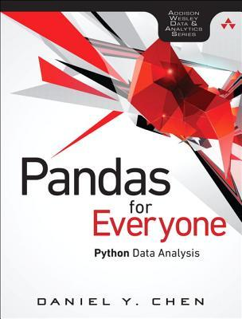</img>
</center>
]


---

# #rstatsnyc

.pull-left[
<center>
<b>2015</b>
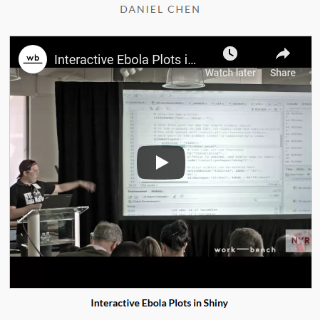</img>
</center>
]

.pull-right[
<center>
<b>2016</b>
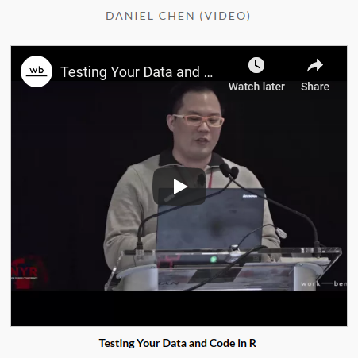</img>
</center>
]

---

# #rstatsnyc

.pull-left[
<center>
<b>2017</b>
</img>
</center>
]

.pull-right[
<center>
<b>2018</b>
</img>
</center>
]

---

# What do these talks have in common?

How I do my work.

What I teach my students (and you)!

Working together with multiple people.

Being confident that things are "correct".

---

# Structuring Your Data Science Projects

We are happy when our code just runs

R has given us the tools to make your projects more structured and organized

Many people converge on very similar project templates

It doesn't matter where you are in your learning path

## tl;dr

> I just want stuff to run the first time around

---

# Tidy Data Paper -- Billboard Dataset

- Tidy data paper
- Billboard dataset
- Github repository has "original" and "cleaned" data

---

# A Tale of Two Dialects

.pull-left[
<center>
</img>
</center>
]

.pull-right[
<center>
</img>
</center>
]

---

# Clean Data (Original)

```{r, eval=FALSE}
library(stringr)
library(plyr)

rm(list = ls()) #<<
setwd('~/git/hub/rstatsdc_2018-structure/01-just_starting_out/') #<<

raw <- read.csv("billboard.csv")

raw <- raw[, c("year", "artist.inverted", "track", "time", "date.entered", "x1st.week", #<<
               "x2nd.week", "x3rd.week", "x4th.week", "x5th.week", "x6th.week", "x7th.week", "x8th.week", "x9th.week", "x10th.week", "x11th.week", "x12th.week", "x13th.week", "x14th.week", "x15th.week", "x16th.week", "x17th.week", "x18th.week", "x19th.week", "x20th.week", "x21st.week", "x22nd.week", "x23rd.week", "x24th.week", "x25th.week", "x26th.week", "x27th.week", "x28th.week", "x29th.week", "x30th.week", "x31st.week", "x32nd.week", "x33rd.week", "x34th.week", "x35th.week", "x36th.week", "x37th.week", "x38th.week", "x39th.week", "x40th.week", "x41st.week", "x42nd.week", "x43rd.week", "x44th.week", "x45th.week", "x46th.week", "x47th.week", "x48th.week", "x49th.week", "x50th.week", "x51st.week", "x52nd.week", "x53rd.week", "x54th.week", "x55th.week", "x56th.week", "x57th.week", "x58th.week", "x59th.week", "x60th.week", "x61st.week", "x62nd.week", "x63rd.week", "x64th.week", "x65th.week", "x66th.week", "x67th.week", "x68th.week", "x69th.week", "x70th.week", "x71st.week", "x72nd.week", "x73rd.week", "x74th.week", "x75th.week", #<<
               "x76th.week")] #<<
names(raw)[2] <- "artist"

raw$artist <- iconv(raw$artist, "MAC", "ASCII//translit")
raw$track <- stringr::str_replace(raw$track, " \\(.*?\\)", "")
names(raw)[-(1:5)] <- str_c("wk", 1:76)
raw <- plyr::arrange(raw, year, artist, track)

long_name <- nchar(raw$track) > 20
raw$track[long_name] <- paste0(substr(raw$track[long_name], 0, 20), "...")
```

---

# Clean Data

```{r, echo=FALSE, message=FALSE}
library(stringr)
library(plyr)

raw <- read.csv("./01-just_starting_out/billboard.csv")

raw <- raw[, c("year", "artist.inverted", "track", "time", "date.entered", "x1st.week", #<<
               "x2nd.week", "x3rd.week", "x4th.week", "x5th.week", "x6th.week", "x7th.week", "x8th.week", "x9th.week", "x10th.week", "x11th.week", "x12th.week", "x13th.week", "x14th.week", "x15th.week", "x16th.week", "x17th.week", "x18th.week", "x19th.week", "x20th.week", "x21st.week", "x22nd.week", "x23rd.week", "x24th.week", "x25th.week", "x26th.week", "x27th.week", "x28th.week", "x29th.week", "x30th.week", "x31st.week", "x32nd.week", "x33rd.week", "x34th.week", "x35th.week", "x36th.week", "x37th.week", "x38th.week", "x39th.week", "x40th.week", "x41st.week", "x42nd.week", "x43rd.week", "x44th.week", "x45th.week", "x46th.week", "x47th.week", "x48th.week", "x49th.week", "x50th.week", "x51st.week", "x52nd.week", "x53rd.week", "x54th.week", "x55th.week", "x56th.week", "x57th.week", "x58th.week", "x59th.week", "x60th.week", "x61st.week", "x62nd.week", "x63rd.week", "x64th.week", "x65th.week", "x66th.week", "x67th.week", "x68th.week", "x69th.week", "x70th.week", "x71st.week", "x72nd.week", "x73rd.week", "x74th.week", "x75th.week", #<<
               "x76th.week")] #<<
names(raw)[2] <- "artist"

raw$artist <- iconv(raw$artist, "MAC", "ASCII//translit")
raw$track <- stringr::str_replace(raw$track, " \\(.*?\\)", "")
names(raw)[-(1:5)] <- str_c("wk", 1:76)
raw <- plyr::arrange(raw, year, artist, track)

long_name <- nchar(raw$track) > 20
raw$track[long_name] <- paste0(substr(raw$track[long_name], 0, 20), "...")
head(raw)
```

---

# Clean Data (Tidyverse)

```{r, eval=FALSE}
library(readr)
library(dplyr)
library(stringr)

rm(list = ls()) #<<
setwd('~/git/hub/rstatsdc_2018-structure/01-just_starting_out/') #<<

(raw <- readr::read_csv('billboard.csv') %>%
    dplyr::select(year, artist.inverted, track, time, date.entered,
                  x1st.week:x76th.week) %>% #<<
    dplyr::rename(artist = artist.inverted) %>%
    dplyr::mutate(artist = iconv(artist, "MAC", "ASCII//translit")) %>%
    dplyr::mutate(track = stringr::str_replace(track,  " \\(.*?\\)", "")) %>%
    dplyr::arrange(year, artist, track) %>%
    dplyr::mutate(track = dplyr::case_when(
        nchar(track) > 20 ~ stringr::str_c(stringr::str_sub(track, 0, 20), "..."),
        TRUE ~ track
    ))
)
(names(raw)[-(1:5)] <- str_c("wk", 1:76)) # changed the order here #<<
```

---

# Clean Data

```{r, echo=FALSE, message=FALSE}
library(readr)
library(dplyr)
library(stringr)

raw <- readr::read_csv('./01-just_starting_out/billboard.csv') %>%
    dplyr::select(year, artist.inverted, track, time, date.entered,
                  x1st.week:x76th.week) %>%
    dplyr::rename(artist = artist.inverted) %>%
    dplyr::mutate(artist = iconv(artist, "MAC", "ASCII//translit")) %>%
    dplyr::mutate(track = stringr::str_replace(track,  " \\(.*?\\)", "")) %>%
    dplyr::arrange(year, artist, track) %>%
    dplyr::mutate(track = dplyr::case_when(
        nchar(track) > 20 ~ stringr::str_c(stringr::str_sub(track, 0, 20), "..."),
        TRUE ~ track
    ))

# anyone know how to add this to the pipeline?
names(raw)[-(1:5)] <- str_c("wk", 1:76) # changed the order here
raw
```

---

<center>
<div class="demo">Demo 01</div>
</center>

---

# Do you want your computer set on fire...?
... because that's how you get your computer set on fire.

<center>
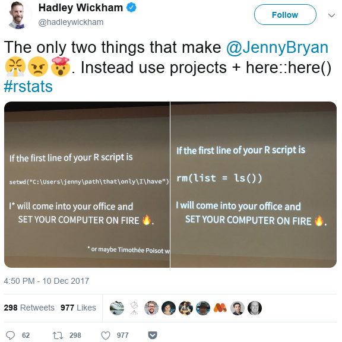</img>
</center>

---

# What's wrong with `setwd()`?

- **You are assuming a folder structure**
    - Your collaborator might not have the same structure
    - Your other computer might not have the same structure
    - You want to move files and folders around and now... you guessed it, don't have the same structure!

- You end up having a different line in your code for every possible location and commenting it in and out
    - Annoying for yourself, others, and
    - Version control systems

---

# Make a Project

<center>
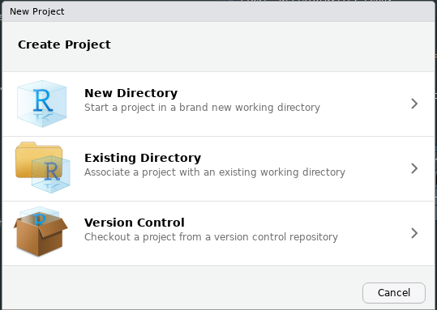</img>
</center>

```{bash}
diff -r 01-just_starting_out 02-projects | grep "Only in 02-projects"
```

---

# RStudio projects assume everyone is using RStudio

```{r}
TRUE
```

#### but...

- Emacs ESS allows you to pick the working directory
- `cd` in linux changes the working directory
    - Run code from working directory

---

# What's wrong with `rm(list = ls())`?

- **It doesn't detatch libraries**
    - You might end up using a function without an explicit `library` call in your script

## What do I do instead?

1. RStudio: Session > Restart R (Ctrl + Shift + F10)
2. Terminal: `Rscript myscript.R`

---

<center>
<div class="demo">Demo 02</div>
</center>


---

# Am I done yet? Yes, but...

<center>
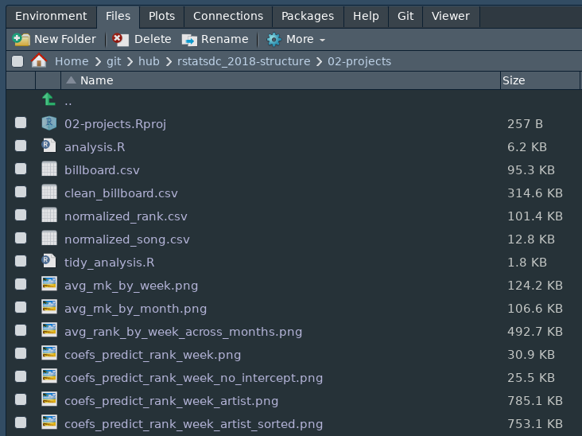</img>

---

# `project += structure`

Yes this is the whole point of this talk...

<center>
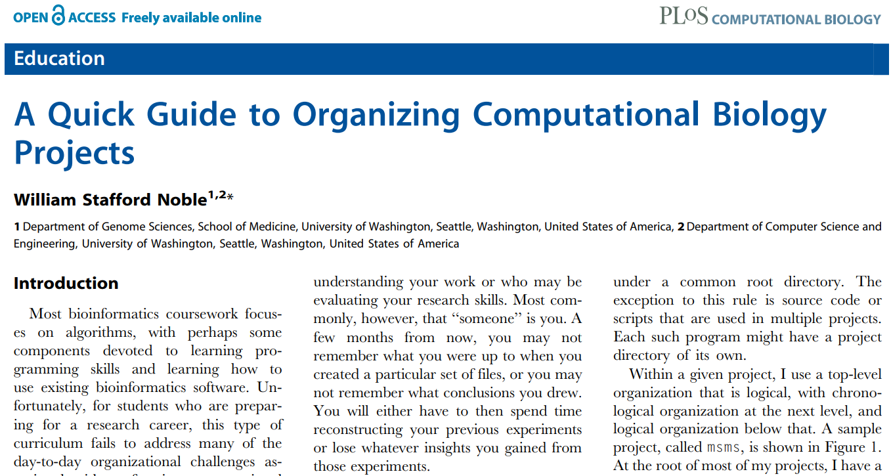</img>
</center>

---

# Noble's recommendations

<center>
</img>
</center>

---

# What I/we do

<center>
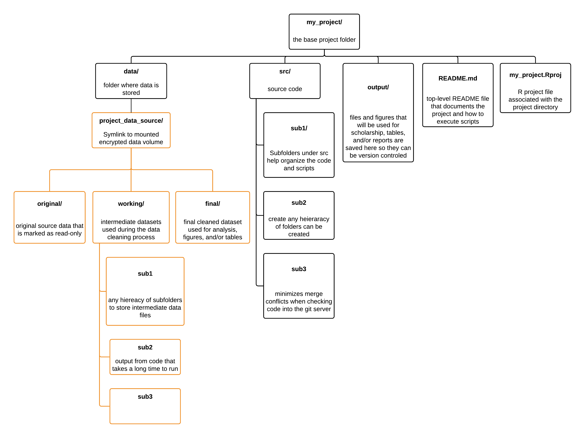</img>
</center>

---

# But basically...

1. **Data** (e.g., `data`)
    1. `orginal` folder from your original (read-only) data
    2. `processed` folder that your scripts create
        - If you want you can break down `processed` to `intermediate` and/or `final`
        - Do whatever feels right
    - Create symbolic links (i.e., shortcuts) as needed if you are using a version control system.
2. **Code** (e.g., `src`, `analysis`)
    - Same thing as the data folder: create subfolders as necessary
3. **Output** (e.g., `output`, `plots`, `results`)<sup>1</sup>
    1. Things your script outputs that is not a dataset
    2. `git` does not track empty folders, so put in a `README.md` or `.gitkeep` file
4. **Functions** (e.g., `R`)
5. **README** files

Make sub-folders as needed, everything is in a project and/or has a fixed working directory.

.footnote[[1] Can get weird in `git` with image conflicts. But works great on shared drives/dropbox!]

---

<center>
<div class="demo">Demo 03</div>
</center>

---

# Can we do better? Of course.

#### How long is my script?

```{bash}
wc 01-just_starting_out/analysis.R
```

#### What does my script do?

1. Loads
2. Cleans
3. Tidy
4. Normalize
5. EDA
6. Model

---

# Split it up into separate scripts ... in a subfolder

.pull-left[
1. Loads
2. Cleans
3. Tidy
4. Normalize
5. EDA
6. Model
]

.pull-right[
1. `01-load.R`
2. `02-01-clean.R`
3. `02-02-tidy.R`
4. `02-03-normalize.R`
5. `03-eda.R`
6. `04-model.R`
]

Be sensible, a 2 line script is probably not worth it, but a 2000 line script is unwieldy.

---

<center>
<div class="demo">Demo 04</div>
</center>

---

# What else?

Rachael Tatman (from Kaggle) @rctatman

- R-Ladies organizer (Seattle chapter)
- Data scientist at Kaggle
- RLadies DC Meetup: Put together a data science portfolio
    - http://www.rctatman.com/files/Tatman_2018_DataSciencePortfolios_DC.pdf

---

<center>
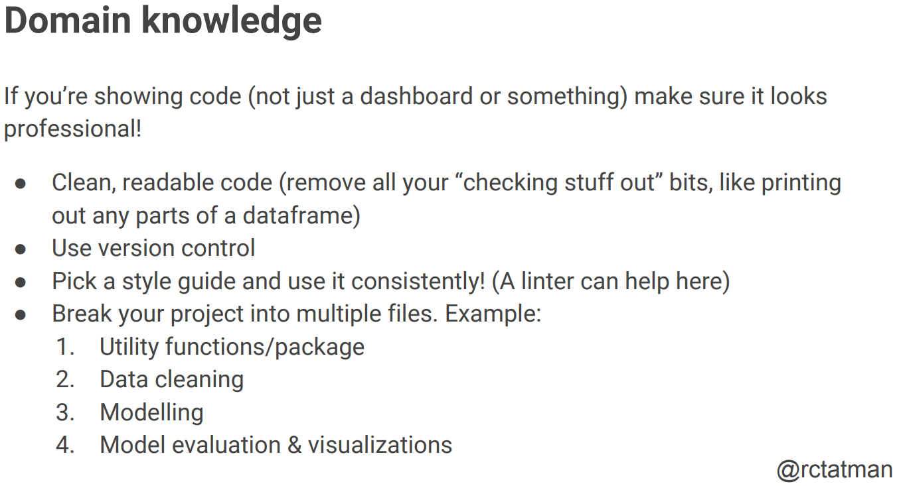</img>
</center>

---

<center>
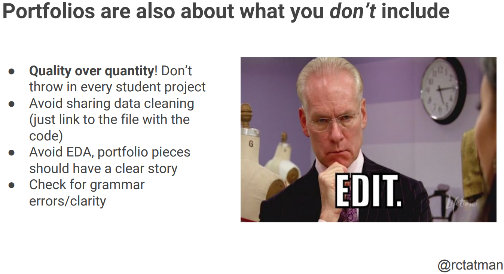</img>
</center>

---

# Knitr

.pull-left[
1. Loads
2. Cleans
3. Tidy
4. Normalize
5. EDA
6. Model
]

.pull-right[
1. `01-load.R`
2. `02-01-clean.R`
3. `02-02-tidy.R`
4. `02-03-normalize.R`
5. `03-eda.Rmd`
6. `04-model.Rmd`
]

---

# But...

- Sometimes working with knitr in RStudio projects get weird because of working directories <sub>[1]</sub>
- I won't work in RStudio

## Fix this with the `here` [package](https://here.r-lib.org/)

- It's based off [rprojroot](https://rprojroot.r-lib.org/)

In `here::here()`:
- Is a file named .here present?
- Is this an RStudio Project? Literally, can I find a file named something like foo.Rproj?
- Is this an R package? Does it have a DESCRIPTION file?
- Is this a remake project? Does it have a file named remake.yml?
- Is this a projectile project? Does it have a file named .projectile?
- Is this a checkout from a version control system? Does it have a directory named .git or .svn? - Currently, only Git and Subversion are supported.

.footnote[[1] Also loses file tab completion within `Rmd` document. Worth?]
---

<center>
<div class="demo">Demo 05</div>
</center>

---

# Functions

Not shown in this example

#### But...

1. Put them in an `R` folder for easy reference and `source`ing.
2. Get's the analysis project ready to turn into an R package

---

# What about scholarship/formal reports (LaTeX)?

1. Sibbling project

```{bash, eval=FALSE}
\begin{figure}[H]
    \centering
    \includegraphics[width=.7\linewidth]{../06-make/output/billboard_rank_plots/avg_rank_by_week_across_months}
    \caption[]{Average ratings over time by different starting months}
    \label{fig:avgrankbyweekacrossmonths}
\end{figure}
```
2. Child project (git submodules?)
  - Symbolic links (i.e., shortcuts) could work too
```{bash, eval=FALSE}
\begin{figure}[H]
    \centering
    \includegraphics[width=.7\linewidth]{./06-make/output/billboard_rank_plots/avg_rank_by_week_across_months}
    \caption[]{Average ratings over time by different starting months}
    \label{fig:avgrankbyweekacrossmonths}
\end{figure}
```

---

# `knitr` button puts output in the source file location

The output document is put in the `analysis` folder.
I want it in the `output` folder!

#### Solution

use `rmarkdown::render()`

```{r, eval=FALSE}
# not executed during build
rmarkdown::render(here::here('./analysis/billboard_eda/03-eda.Rmd'),
                  output_dir = './output/billboard_reports') #<<
```

---

# Too many commands to run!

1. Shell Script
2. Make
3. RStudio > Build (?)
---

# Makefile

```make
BILLBOARD=./analysis/billboard_eda/

all : commands

## commands      : show all commands.
commands :
	@grep -E '^##' Makefile | sed -e 's/## //g'

## billboard_eda  : re-generate billboard eda analsyis
billboard_eda :
	Rscript ${BILLBOARD}/01*
	Rscript ${BILLBOARD}/02-01*
	Rscript ${BILLBOARD}/02-02*
	Rscript ${BILLBOARD}/02-03*
	Rscript -e "rmarkdown::render(here::here('./analysis/billboard_eda/03-eda.Rmd'), output_dir = './output/billboard_reports')"
	Rscript -e "rmarkdown::render(here::here('./analysis/billboard_eda/04-model.Rmd'), output_dir = './output/billboard_reports')"

## clean         : clean up junk files.
clean :
	find data/ -type f -name '*.csv' | xargs rm
	find analysis/ type f -name '*.html' | xargs rm
```

---

<center>
<div class="demo">Demo 06</div>
</center>

---

.pull-left[
# In sum...

1. Use R
2. Make a project
3. Organize the project into folders and use `here::here()` to get project relative paths
4. Break up scripts into smaller pieces
5. RMarkdown for things you want to show
6. Write `Makefiles`, shell scripts, or other build scripts and link your projects to scholarship so your figures and tables are always up to date
]

.pull-right[
<center>
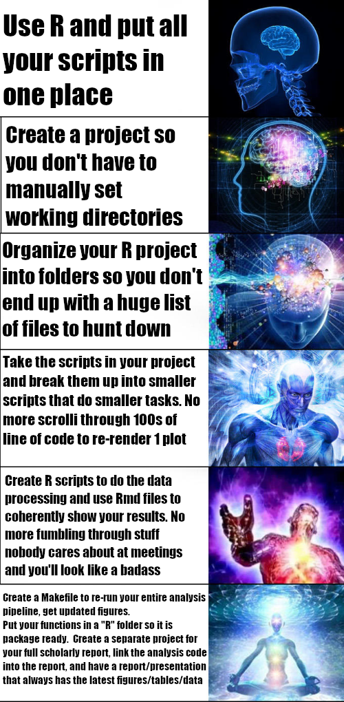</img>
</center>
]

---

# (More) Resources

- slide template: xaringan (remark.js)
- [Jenny Bryan - Stop working directory insanity](https://gist.github.com/jennybc/362f52446fe1ebc4c49f)
- [Jenny Bryan - Naming things](https://speakerdeck.com/jennybc/how-to-name-files)
- [John Myles White - ProjectTemplate](http://projecttemplate.net/)
- [John Blischak - workflowr: organized + reproducible + shareable data science in R](https://jdblischak.github.io/workflowr/)
---

# Thanks!

github/twitter/gmail/instagram: `@chendaniely`

Slides/code/repo: https://github.com/chendaniely/rstatsdc_2018-structure
